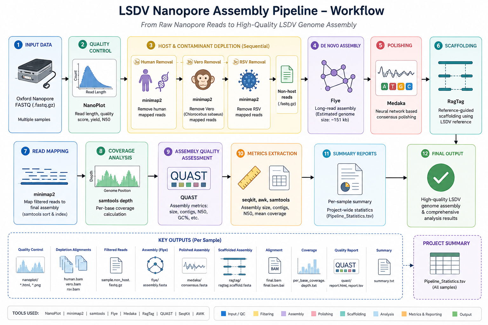

# LSDV Nanopore Assembly Pipeline

<div align="center">


### Automated Long-Read Genome Assembly and Analysis Workflow for Lumpy Skin Disease Virus (LSDV)

</div>

---
## Pipeline Workflow

<p align="center">
  
</p>

**Figure 1.** Overview of the LSDV Nanopore Assembly Pipeline. Raw Oxford Nanopore sequencing reads undergo quality assessment using NanoPlot, sequential host and contaminant depletion (Human, Vero, and RSV), de novo genome assembly using Flye, consensus polishing with Medaka, reference-guided scaffolding with RagTag, coverage analysis, assembly quality assessment using QUAST, and automated report generation.

## Abstract

The **LSDV Nanopore Assembly Pipeline** is a fully automated, production-grade bioinformatics workflow developed for whole-genome reconstruction of **Lumpy Skin Disease Virus (LSDV)** from Oxford Nanopore Technologies (ONT) sequencing data.

The workflow integrates:

- Sequential host and contaminant depletion
- Long-read de novo genome assembly
- Neural-network consensus polishing
- Reference-guided scaffolding
- Assembly quality assessment
- Per-base coverage analysis
- Automated statistical reporting

The pipeline is designed for genomic surveillance, outbreak investigation, molecular epidemiology, and comparative genomics studies of Capripoxviruses.

---

# Scientific Background

Lumpy Skin Disease Virus (LSDV) is a double-stranded DNA virus belonging to the genus *Capripoxvirus* within the family *Poxviridae*.

The LSDV genome:

| Property | Value |
|-----------|--------|
| Genome Type | Linear dsDNA |
| Genome Size | ~150–151 kb |
| Family | Poxviridae |
| Genus | Capripoxvirus |
| GC Content | ~25–26% |
| Host Range | Cattle and buffalo |

Long-read sequencing technologies such as Oxford Nanopore enable near-complete reconstruction of viral genomes, including repetitive regions that may be challenging to resolve using short-read technologies.

---

# Pipeline Design Philosophy

The workflow follows four fundamental principles:

### Accuracy

Removal of non-target reads prior to assembly reduces assembly artifacts and improves consensus quality.

### Reproducibility

All software versions are managed through Conda environments to ensure computational reproducibility.

### Scalability

The pipeline supports batch processing of multiple sequencing libraries and HPC deployment.

### Automation

Minimal user intervention is required after execution.

---

# Workflow Architecture

```text
Raw ONT FASTQ Reads
         │
         ▼
┌──────────────────────────┐
│ Environment Validation   │
└──────────────────────────┘
         │
         ▼
┌──────────────────────────┐
│ Human Depletion          │
│ GRCh38                   │
└──────────────────────────┘
         │
         ▼
┌──────────────────────────┐
│ Vero Cell Depletion      │
│ Chlorocebus sabaeus      │
└──────────────────────────┘
         │
         ▼
┌──────────────────────────┐
│ RSV Depletion            │
└──────────────────────────┘
         │
         ▼
Filtered Viral Reads
         │
         ▼
┌──────────────────────────┐
│ Flye Assembly            │
└──────────────────────────┘
         │
         ▼
┌──────────────────────────┐
│ Medaka Consensus         │
└──────────────────────────┘
         │
         ▼
┌──────────────────────────┐
│ RagTag Scaffolding       │
└──────────────────────────┘
         │
         ▼
Final LSDV Genome
         │
         ├──────── QUAST
         ├──────── Coverage Analysis
         └──────── Summary Statistics
```

---

# Computational Methodology

## 1. Environment Validation

Prior to execution, the workflow validates:

- Software dependencies
- Input FASTQ files
- Reference genomes
- Output directories
- Computational resources

Execution terminates immediately if validation fails.

---

## 2. Sequential Host Depletion

To maximize assembly specificity, reads are sequentially mapped and filtered against:

### Human Reference Genome

Reference:

```text
human_GRCh38.fa
```

Tool:

```bash
minimap2
samtools
```

---

### Vero Cell Reference

Reference:

```text
Chlorocebus_sabaeus.fa
```

Vero cell contamination is frequently observed in viral culture-derived samples.

---

### RSV Reference

Reference:

```text
RSV_reference.fasta
```

Cross-contaminating viral reads are removed before assembly.

---

## 3. De Novo Assembly

Assembly is performed using Flye.

### Assembly Algorithm

Flye constructs a repeat graph from long-read overlaps and generates consensus contigs optimized for Nanopore sequencing data.

Example:

```bash
flye \
    --nano-hq reads.fastq.gz \
    --genome-size 151k
```

---

## 4. Consensus Polishing

Consensus refinement is performed using Medaka.

### Purpose

- Correct residual ONT sequencing errors
- Improve consensus accuracy
- Resolve local assembly artifacts

Default model:

```text
r1041_e82_400bps_sup_v5.0.0
```

---

## 5. Reference-Guided Scaffolding

Scaffolding is performed using RagTag.

### Objectives

- Orient contigs
- Resolve structural fragmentation
- Generate a complete genome representation

Reference:

```text
LSDV_reference.fasta
```

---

## 6. Coverage Analysis

Reads are remapped to the final scaffolded genome.

Coverage statistics are generated using:

```bash
samtools depth
```

Outputs:

```text
per_base_coverage.depth.txt
```

---

## 7. Assembly Quality Assessment

Assembly evaluation is performed using QUAST.

Metrics include:

- Total assembly size
- Number of contigs
- N50
- GC content
- Misassembly detection
- Reference alignment statistics

---

# Installation

## Create Environment

```bash
conda env create -f environment.yml
conda activate lsdv_pipeline_env
```

---

# Required Directory Structure

```text
project/
│
├── lsdv_pipeline.sh
├── environment.yml
│
├── Fastq_files/
│   ├── sample01.fastq.gz
│   ├── sample02.fastq.gz
│   └── sample03.fastq.gz
│
└── Host_references/
    ├── human_GRCh38.fa
    ├── Chlorocebus_sabaeus.fa
    ├── RSV_reference.fasta
    └── LSDV_reference.fasta
```

---

# Usage

## Basic Execution

```bash
./lsdv_pipeline.sh \
    -i Fastq_files \
    -r Host_references
```

---

## High-Performance Execution

```bash
./lsdv_pipeline.sh \
    -i Fastq_files \
    -r Host_references \
    -w LSDV_Run \
    -t 32 \
    -g 151k \
    -m r1041_e82_400bps_sup_v5.0.0
```

---

# Output Structure

```text
LSDV_analysis/
│
├── Pipeline_Statistics.tsv
│
├── SAMPLE_01/
│   ├── summary.txt
│   ├── final.bam
│   ├── final.bam.bai
│   ├── per_base_coverage.depth.txt
│   ├── ragtag/
│   │   └── ragtag.scaffold.fasta
│   └── quast/
│
└── SAMPLE_02/
```

---

# Master Statistics File

The pipeline automatically generates:

```text
Pipeline_Statistics.tsv
```

Columns:

| Metric |
|----------|
| Sample |
| RawReads |
| HumanRemoved |
| VeroRemoved |
| RSVRemoved |
| RemainingReads |
| RemainingPct |
| AssemblySize |
| Contigs |
| N50 |
| MeanCoverage |

---

# Software Dependencies

| Software | Version |
|-----------|-----------|
| minimap2 | ≥2.26 |
| samtools | 1.19 |
| Flye | ≥2.9.3 |
| Medaka | 1.11.3 |
| RagTag | ≥2.1.0 |
| QUAST | ≥5.2.0 |
| SeqKit | ≥2.8.0 |

---

# Reproducibility

This workflow supports reproducible analyses through:

- Conda-based dependency management
- Version-controlled software stack
- Automated validation checks
- Deterministic execution framework
- Comprehensive logging and reporting

---

# Intended Applications

- Genomic surveillance
- Outbreak investigations
- Comparative genomics
- Molecular epidemiology
- Reference genome generation
- Diagnostic sequencing workflows

---

# Limitations

- Designed specifically for Oxford Nanopore sequencing data.
- Performance depends on sequencing depth and viral load.
- Highly fragmented input datasets may reduce assembly continuity.
- Reference-guided scaffolding may introduce reference bias if highly divergent strains are analyzed.

---

# Citation

If you use this workflow in a publication, please cite:

- Flye
- Medaka
- RagTag
- QUAST
- minimap2
- samtools

and cite this repository.

---

# License
Copyright (c) 2026 Vinay Rajput

This software is provided for academic and research purposes only.

Commercial use, redistribution, modification, or incorporation into proprietary software is prohibited without prior written permission from the author.

---

# Author

**Dr. Vinay Rajput, PhD**  
National Institute of Virology, Pune, India

---

## Release Information

**LSDV Nanopore Assembly Pipeline v1.0.0**

Production Release • 2026

Designed for automated, reproducible, and scalable reconstruction of Lumpy Skin Disease Virus genomes from Oxford Nanopore sequencing data.
